# Project NOOS

뇌파로 사용자의 상태를 확인하고, 그 상태에 맞는 음악과 조명을 자동으로 바꿔주는 프로젝트입니다.

NOOS는 Muse S Athena EEG 기기로 사용자의 뇌파 데이터를 받고, Spring Boot 백엔드가 AI 분석 모듈과 음악 생성, 조명 제어를 연결하는 방식으로 동작합니다. 사용자는 복잡한 뇌파 수치를 직접 보는 대신, 자신의 상태에 맞는 음악과 조명 피드백을 경험할 수 있습니다.

> 이 프로젝트는 의료 진단이나 치료 목적이 아니라, EEG 데이터를 활용한 사용자 상태 인식과 환경 피드백을 실험한 종합설계 프로젝트입니다.

## 프로젝트 정보

| 항목 | 내용 |
| --- | --- |
| 프로젝트명 | Project NOOS |
| 주제 | 실시간 뇌파 기반 AI 음악, 조명 피드백 시스템 |
| 팀 | TEAM:AXIS |
| 개발 기간 | 2026년 3월 - 2026년 6월 |
| 내 역할 | 백엔드 및 DB 총괄 |

## 전체 아키텍처

프론트엔드는 사용자 화면과 Muse 연결을 담당하고, 백엔드는 인증, DB, EEG 저장, AI 음악 생성, WiZ 조명 제어를 묶는 중심 서버 역할을 합니다.

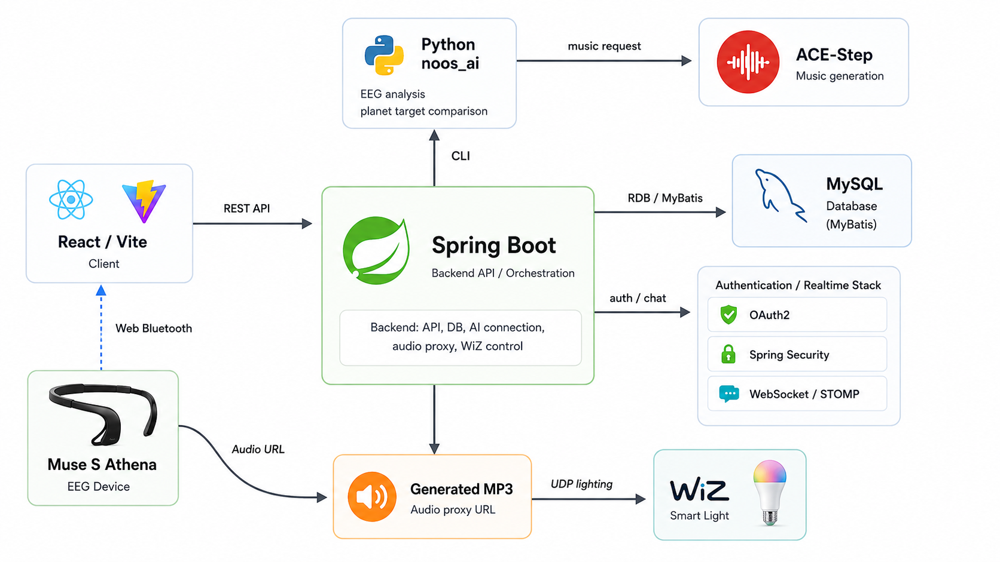

## 내가 개발한 부분

이 프로젝트에서 저는 백엔드와 DB 쪽을 중심으로 개발했습니다. 프론트엔드에서 들어온 요청을 AI 모듈, 음악 생성 서버, 조명 제어 기능과 연결하는 역할을 맡았습니다.

주요 작업은 다음과 같습니다.

- Spring Boot 기반 백엔드 API 설계 및 구현
- 프론트엔드와 Python AI 모듈 연결
- EEG 분석 요청을 받고 결과를 저장하는 흐름 구현
- ACE-Step 음악 생성 요청 처리
- 생성된 오디오를 프론트엔드에서 재생할 수 있도록 프록시 API 구현
- WiZ 스마트 조명 제어 API 연동
- OAuth2 로그인 후 프론트엔드로 돌아오는 리다이렉트 문제 해결
- MyBatis와 MySQL 기반 DB 연동 구조 관리
- 백엔드 실행 중 발생한 버전 호환성, 인증 흐름 문제 해결

## 프로젝트가 동작하는 방식

NOOS는 사용자의 현재 상태를 확인한 뒤, 선택한 행성의 목표 환경에 맞춰 음악과 조명을 생성합니다.

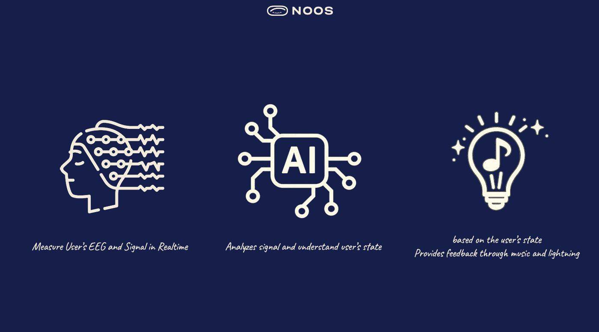

## 주요 기능

- Muse S Athena EEG 기반 상태 데이터 수집
- 기기 미보유 사용자를 위한 설문 기반 상태 측정
- 사용자 상태 분석 및 목표 상태 설정
- 행성별 목표 환경 선택
- AI 기반 음악 생성 요청
- WiZ 조명 색상, 밝기 제어
- 여행 기록 저장 및 뇌파 전후 비교
- OAuth2 로그인과 사용자 세션 관리
- 게시판, 채팅 등 기본 서비스 기능

## 기술 스택

| 구분 | 사용 기술 |
| --- | --- |
| Frontend | React, Vite, React Router |
| Backend | Java 17, Spring Boot 3.4.3 |
| Auth | Spring Security, OAuth2 |
| Database | MySQL, MyBatis |
| AI | Python, noos_ai CLI |
| EEG 연동 | Muse S Athena, Web Bluetooth API |
| 음악 생성 | ACE-Step API |
| 조명 제어 | WiZ Smart Light, UDP |
| Test | Vitest, JUnit 5, Python unittest |

## 백엔드 API

백엔드 API는 Swagger로 기능별로 정리했습니다. README에는 전체 API 표를 길게 넣는 대신, Swagger API 명세서 캡처를 순서대로 첨부했습니다.

### 1. Auth / Admin API

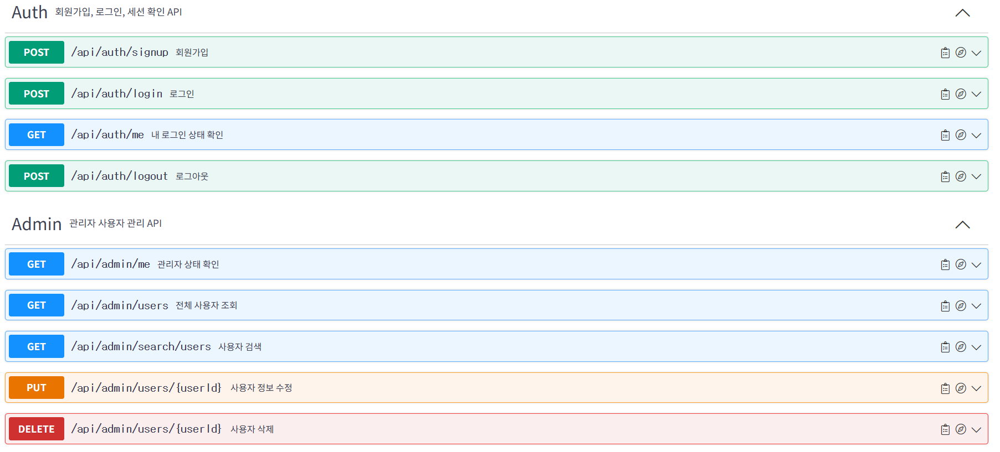

### 2. EEG / AI API

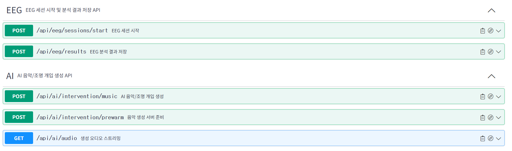

### 3. Lighting API

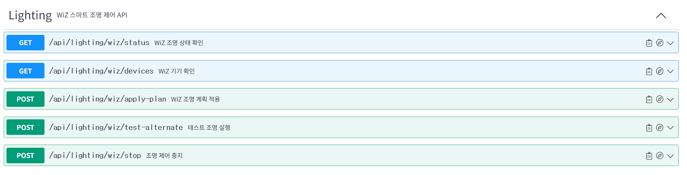

### 4. Board API

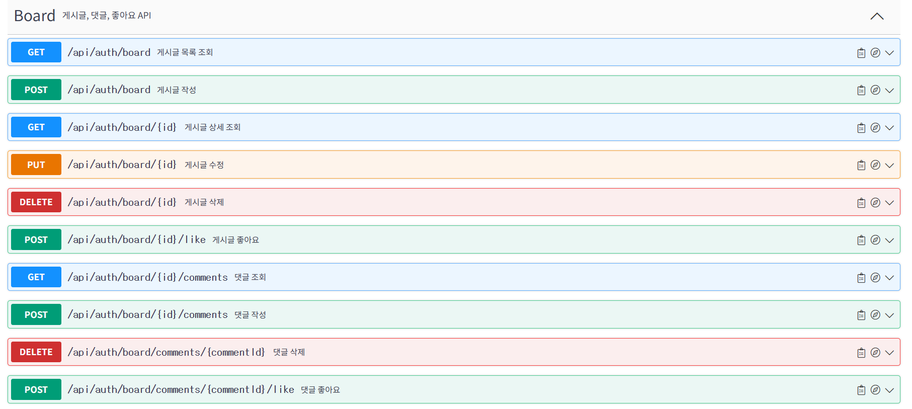

### 5. Chat API

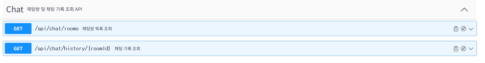

## DB 구조

사용자, EEG 세션/결과, 게시판, 채팅, 피드백, 음악/조명 개입 기록을 저장하는 DB 구조입니다.

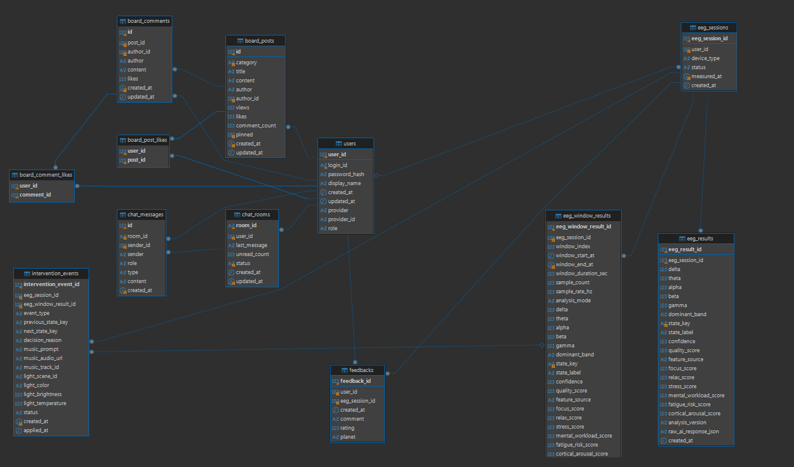

## 동작 시연 영상

NOOS의 전체 흐름을 확인할 수 있는 동작 시연 영상입니다.

### [YouTube에서 Project NOOS 동작 시연 영상 보기](https://youtu.be/9vzqvD_II20)

[영상 주소: https://youtu.be/9vzqvD_II20](https://youtu.be/9vzqvD_II20)

## 화면 흐름

로그인 이후 사용자는 Muse S Athena 기기 보유 여부에 따라 실시간 EEG 측정 또는 설문 기반 측정 흐름으로 이동합니다. 이후 원하는 행성을 선택하면, 선택한 행성의 목표 환경과 현재 상태를 비교해 음악과 조명 피드백이 생성됩니다.

### 1. Muse S Athena 보유 여부 확인

사용자에게 Muse S Athena 기기를 가지고 있는지 먼저 확인합니다.

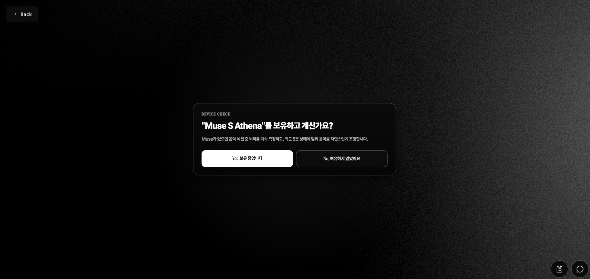

### 2. 기기가 있는 경우: Bluetooth 페어링

기기를 보유하고 있다면 Web Bluetooth로 Muse S Athena를 연결하고, 실시간 EEG 스트림을 준비합니다.

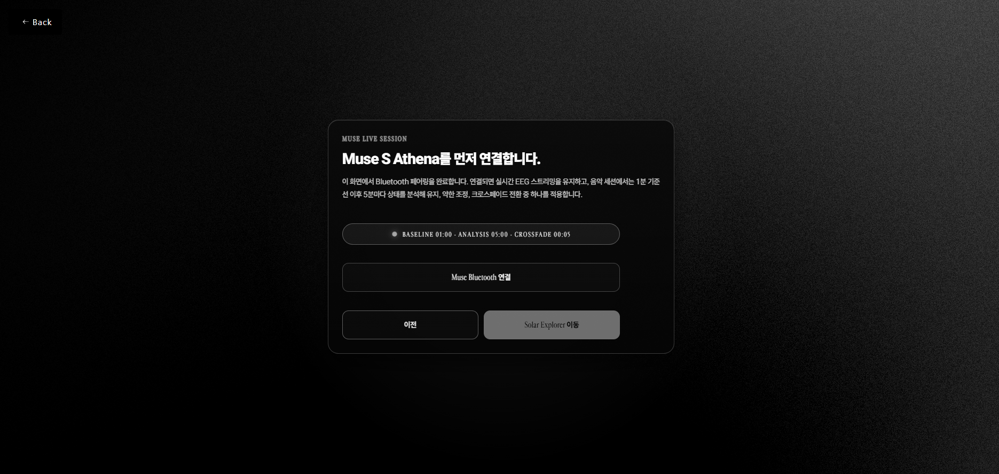

### 3. 기기가 없는 경우: 설문 기반 상태 측정

기기가 없다면 설문조사를 통해 현재 집중도, 긴장도, 피로도 같은 상태를 추정합니다.

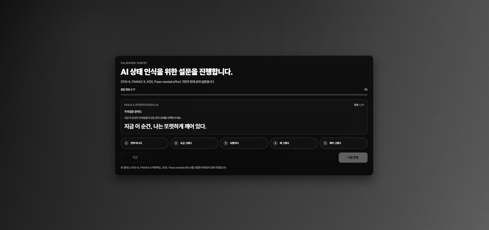

### 4. 행성 선택

사용자는 가고 싶은 행성을 선택합니다. 각 행성은 서로 다른 목표 상태와 환경 조성을 의미합니다.

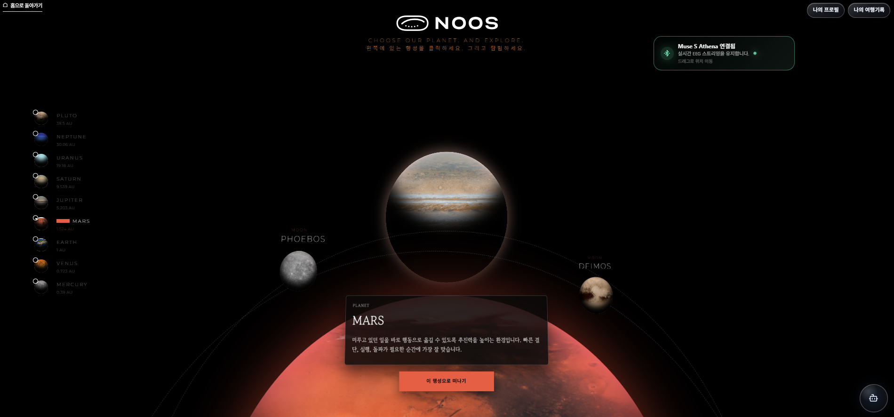

### 5. 실시간 뇌파 스트림과 음악 재생

선택한 행성의 목표 환경과 현재 상태를 비교해 알맞은 음악을 생성하고, 여정 중에는 실시간 뇌파 스트림과 음악 플레이어를 함께 보여줍니다.

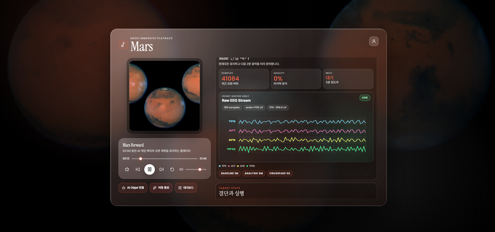

### 6. 여정 기록과 Before / After 비교

여정이 끝나면 이전에 측정했던 기록을 다시 볼 수 있고, 뇌파 밴드와 상태 지표가 전후로 어떻게 달라졌는지 비교할 수 있습니다.

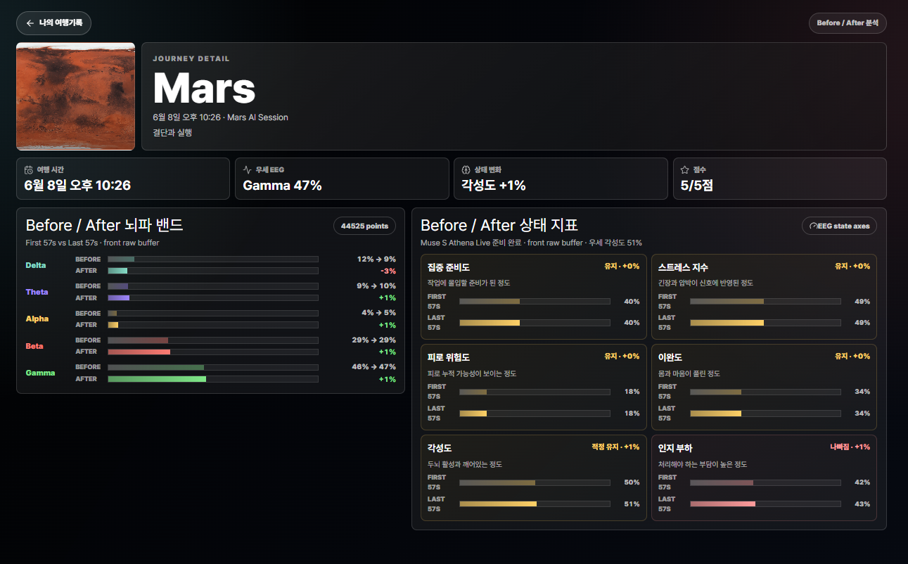

## 트러블슈팅

문제가 생겼을 때 원인을 추적하고 해결한 내용을 핵심 위주로 정리했습니다.

<details>
<summary><strong>1. Spring Boot와 MyBatis 버전 호환성 문제</strong></summary>

- 문제: 서버 실행 시 `Property 'sqlSessionFactory' or 'sqlSessionTemplate' are required` 오류 발생
- 원인: Spring Boot 4.x와 MyBatis-Spring 3.0.3 버전 호환 문제
- 해결: Spring Boot를 3.4.x로 변경하고 Gradle Refresh 후 DB 연결 재확인
- 배운 점: 에러 로그의 `Caused by`를 따라가며 실제 원인을 확인해야 함

</details>

<details>
<summary><strong>2. OAuth2 로그인 후 화면 이동 문제</strong></summary>

- 문제: 소셜 로그인 성공 후 프론트엔드 화면으로 돌아오지 않음
- 원인: 로그인 성공 URL이 백엔드 `/main` 경로로 설정되어 사용자 흐름이 끊김
- 해결: 성공 URL을 `http://localhost:3000/?login=success`로 변경
- 배운 점: 인증 설정은 백엔드뿐 아니라 프론트엔드 라우팅까지 함께 확인해야 함

</details>

<details>
<summary><strong>3. Muse S Athena Web Bluetooth 연동 문제</strong></summary>

- 문제: 기존 `web-muse` 라이브러리로 Muse S Athena EEG 데이터를 읽지 못함
- 원인: 라이브러리가 찾는 characteristic과 실제 기기에서 노출되는 characteristic이 다름
- 확인한 차이: 기존 `273e0003`-`273e0007`, 실제 Muse S Athena `273e0013`-`273e0015`
- 해결: 자체 Web Bluetooth 연결 로직을 구현하고 raw binary packet을 직접 해석
- 배운 점: 하드웨어 연동은 문서와 라이브러리만 믿기보다 실제 기기에서 데이터를 확인해야 함

</details>

## 폴더 구조

```text
noosbeta260215/
+-- frontend/        # React 프론트엔드
+-- backend/         # Spring Boot 백엔드
+-- ai/              # Python AI 분석 모듈
+-- ai-objet-next/   # 임베디드 AI Objet 페이지 원본
+-- docs/            # 문서와 다이어그램
`-- ai/vendor/       # 외부 ACE-Step 관련 코드
```

## 실행 방법

### Frontend

```bash
cd frontend
npm install
npm run start
```

기본 주소: `http://localhost:3000`

### Backend

```bash
cd backend
./gradlew bootRun
```

기본 주소: `http://localhost:8080`

로컬 DB, OAuth2, ACE-Step, WiZ 설정은 Git에 포함되지 않는 로컬 설정 파일에서 관리합니다.

### AI Module

```bash
cd ai
python3 -m venv .venv
source .venv/bin/activate
python3 -m pip install -e .
python3 -m unittest discover -s tests
```

## 참고 문서

- [Project Structure](./docs/PROJECT_STRUCTURE.md)
- [Runtime and Operations](./docs/RUNTIME_AND_OPERATIONS.md)
- [System Flow Diagrams](./docs/system-flow-diagrams/README.md)
- [AI Module](./ai/README.md)
- [Frontend](./frontend/README.md)
- [Backend](./backend/README.md)

## 느낀 점

이 프로젝트를 하면서 백엔드가 단순히 데이터를 저장하고 보내는 역할만 하는 것이 아니라는 점을 배웠습니다. NOOS의 백엔드는 프론트엔드, AI 분석 모듈, 음악 생성 서버, 조명 제어 장치를 연결하는 중심 역할을 했습니다.

특히 로그를 보고 원인을 찾는 과정, OAuth2 인증 흐름을 수정한 경험, 실제 하드웨어와 데이터를 맞춰보는 과정이 가장 큰 학습이었습니다.
