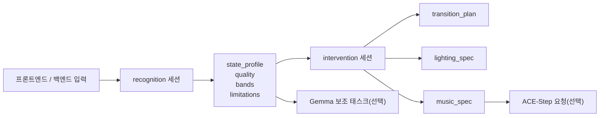

# NOOS AI

`ai` 폴더는 NOOS의 AI 해석 레이어입니다. 이 폴더의 역할은 크게 2가지입니다.

1. Muse 4채널 EEG를 받아 현재 상태를 해석한다. `recognition`
2. 해석된 상태와 사용자가 고른 행성 목표를 바탕으로 조명과 음악 개입안을 만든다. `intervention`

여기서 중요한 점은, 이 폴더가 직접 “치료 판단”을 하거나 “음악 파일을 무조건 생성”하는 엔진은 아니라는 점입니다.  
핵심은 상태를 구조화하고, 그 상태를 바탕으로 설명 가능한 개입 계획을 만드는 것입니다.

전체 프로젝트 구조와 실행 방법은 루트 문서도 함께 보세요.

- [../README.md](../README.md)
- [../docs/PROJECT_STRUCTURE.md](../docs/PROJECT_STRUCTURE.md)
- [../docs/RUNTIME_AND_OPERATIONS.md](../docs/RUNTIME_AND_OPERATIONS.md)

## 한눈에 보기

- 입력은 `readings` 원시 EEG 배열 또는 `band_summary` 요약값이다.
- 핵심 세션은 `recognition`과 `intervention` 두 가지다.
- `recognition`은 현재 상태를 점수와 근거로 정리한다.
- `intervention`은 현재 상태에서 목표 상태까지 가는 조명/음악 명세를 만든다.
- 조명 명세는 현재 `cct-plus-rgb` 구조다. Primary는 연구 기반 CCT, secondary는 행성 RGB 톤이다.
- 실제 음악 생성은 선택 기능이며, 필요할 때만 ACE-Step을 붙인다.
- 설명, 추천, 요약 같은 보조 텍스트 작업은 선택 기능이며, 필요할 때만 Gemma 서비스를 붙인다.

## 이 README가 답하는 질문

- `ai` 폴더는 정확히 무엇을 하나?
- 어디서부터 읽어야 하나?
- 어떤 JSON을 넣어야 하나?
- 어떤 결과가 나오는가?
- Gemma와 ACE-Step은 언제 필요한가?

## 전체 흐름



## 이 폴더가 하는 일과 하지 않는 일

### 하는 일

- Muse 4채널 EEG 입력 정규화
- 신호 품질 점검
- 주파수 밴드 특징 추출
- 현재 상태를 여러 축으로 점수화
- 행성별 목표 상태 정의
- 목표 상태로 이동하기 위한 전환 계획 생성
- 조명 명세와 음악 명세 생성
- ACE-Step에 넘길 요청 페이로드 구성
- Gemma 기반 보조 설명/추천 태스크 제공

### 하지 않는 일

- 의료 진단
- 정신질환 판정
- 뇌과학적으로 과장된 해석
- 하드웨어 조명을 직접 제어하는 최종 드라이버 구현
- 별도 모델 없이 무조건 실제 음악 파일 생성

## 빠른 시작

가장 먼저 해볼 것은 `recognition`과 `intervention` 예시를 한 번씩 실행해 보는 것입니다.

### 1. 기본 패키지 설치

macOS / Linux

```bash
cd "/Users/suhwan/Documents/NOOS AI MODULE/noosbeta260215/ai"
python3 -m venv .venv
source .venv/bin/activate
python3 -m pip install -U pip
python3 -m pip install -e .
```

Windows PowerShell

```powershell
cd C:\noosbeta260215\ai
python -m venv .venv
.\.venv\Scripts\Activate.ps1
python -m pip install --upgrade pip
python -m pip install -e .
```

Windows CMD

```bat
cd /d C:\noosbeta260215\ai
python -m venv .venv
.\.venv\Scripts\activate.bat
python -m pip install --upgrade pip
python -m pip install -e .
```

### 1-1. Windows 백엔드 연동 메모

- Windows에서 backend가 AI CLI를 호출할 때는 `backend/src/main/resources/application.properties`의 `noos.ai.python-bin`을 `python` 또는 가상환경의 `python.exe` 경로로 맞추는 것이 가장 안전합니다.
- 현재 기본값은 `python`으로 되어 있으며, 가상환경을 고정해서 쓰고 싶다면 예를 들어 `C:/noosbeta260215/ai/.venv/Scripts/python.exe`처럼 설정하면 됩니다.
- `python --version` 실행 시 버전 대신 `Python`만 출력되면 실제 인터프리터가 아니라 Windows 실행 별칭일 수 있으니 Python 설치와 PATH 설정을 먼저 확인해야 합니다.

### 2. recognition 예시 실행

```bash
python -m noos_ai.cli examples/recognition_input.json
```

이 명령은 현재 상태를 해석한 JSON을 표준 출력으로 반환합니다.

### 3. intervention 예시 실행

```bash
python -m noos_ai.cli examples/intervention_input.json
```

이 명령은 행성 목표에 맞는 전환 계획, 조명 명세, 음악 명세를 반환합니다.

### 4. 테스트 실행

```bash
python -m unittest discover -s tests
```

## 가장 먼저 읽으면 좋은 파일

- 세션 진입점: [noos_ai/sessions/registry.py](./noos_ai/sessions/registry.py)
- recognition 로직: [noos_ai/sessions/recognition.py](./noos_ai/sessions/recognition.py)
- intervention 로직: [noos_ai/sessions/intervention.py](./noos_ai/sessions/intervention.py)
- 입력 계약: [noos_ai/contracts.py](./noos_ai/contracts.py)
- 조명 계획: [noos_ai/intervention/lighting.py](./noos_ai/intervention/lighting.py)
- 음악 계획: [noos_ai/intervention/music.py](./noos_ai/intervention/music.py)
- Gemma 서비스: [noos_ai/gemma/service.py](./noos_ai/gemma/service.py)
- ACE-Step 연동: [noos_ai/integrations/ace_step.py](./noos_ai/integrations/ace_step.py)

## 폴더 구조

```text
ai/
├── README.md
├── pyproject.toml
├── docs/
├── examples/
├── scripts/
├── tests/
└── noos_ai/
    ├── cli.py
    ├── common.py
    ├── contracts.py
    ├── research.py
    ├── eeg/
    ├── gemma/
    ├── integrations/
    ├── intervention/
    └── sessions/
```

### 각 디렉터리 역할

- `docs/`
  - 연구 근거, 아키텍처, 화면 설계, 행성 taxonomy를 정리한 문서
- `examples/`
  - 바로 실행해 볼 수 있는 입력/출력 샘플
- `scripts/`
  - Gemma 서비스와 ACE-Step API를 띄우는 보조 스크립트
- `tests/`
  - recognition/intervention 핵심 동작 검증
- `noos_ai/eeg/`
  - EEG 전처리, 밴드 정의, 스펙트럼 요약
- `noos_ai/sessions/`
  - 세션 단위 실행 엔진
- `noos_ai/intervention/`
  - 목표 상태, 전환 계획, 조명/음악 명세 계산
- `noos_ai/gemma/`
  - Gemma 기반 보조 API
- `noos_ai/integrations/`
  - 외부 런타임 연동 코드

## 세션 개념

이 프로젝트는 모든 AI 처리를 “세션” 단위로 나눕니다.

- `recognition`
  - 지금 상태를 읽는 단계
- `intervention`
  - 지금 상태에서 목표 상태로 어떻게 이동할지 계획하는 단계

세션 선택은 [noos_ai/sessions/registry.py](./noos_ai/sessions/registry.py)에서 처리합니다.  
`session_type`이 없으면 기본값은 `recognition`입니다.

## 1. recognition 세션

### recognition이 하는 일

`recognition`은 EEG 입력을 받아 현재 상태를 다음처럼 구조화합니다.

- 신호 품질이 usable한가
- 어떤 밴드가 상대적으로 우세한가
- 작업부하가 높은가
- 피로 위험이 높은가
- 스트레스 부하가 높은가
- 이완 수준이 어느 정도인가
- 각성 수준이 어느 정도인가
- 지금 집중에 들어갈 준비가 되어 있는가

### recognition 입력 방식

입력은 두 가지 중 하나면 됩니다.

1. `readings`
   - 원시 시계열 샘플
   - 각 샘플에 `TP9`, `AF7`, `AF8`, `TP10` 4채널이 모두 있어야 함
2. `band_summary`
   - delta/theta/alpha/beta/gamma 비율 요약

두 입력이 모두 있으면 `readings`가 우선됩니다.  
원시 샘플이 있을 때가 더 신뢰도 높은 결과를 기대할 수 있습니다.

### recognition 최소 입력 예시

`band_summary` 기반의 가장 간단한 예시는 아래와 같습니다.

```json
{
  "session_type": "recognition",
  "session_id": "demo-recognition-session",
  "device_type": "Muse S Athena",
  "sample_rate_hz": 256,
  "band_summary": {
    "delta": 8.0,
    "theta": 16.0,
    "alpha": 38.0,
    "beta": 28.0,
    "gamma": 10.0
  }
}
```

실제 예시는 [examples/recognition_input.json](./examples/recognition_input.json)에서 볼 수 있습니다.

### recognition 내부 처리 순서

1. 입력을 `RecognitionRequest`로 정규화
2. 원시 샘플이 있으면 전처리와 품질 평가 수행
3. 밴드 특징과 ratio 계산
4. 상태 축별 점수 계산
5. 대표 상태 label 생성
6. 제한점, 참고문헌, 기준선 정보까지 포함해 결과 JSON 구성

### recognition 주요 출력 필드

- `quality`
  - 신호 사용 가능 여부와 품질 점수
- `bands`
  - 전역/영역별 상대 밴드 비율
- `features.snapshot`
  - ratio를 포함한 계산용 특징값 묶음
- `state_profile.dimensions`
  - 핵심 상태 축 점수와 confidence
- `state_profile.label`
  - 사람이 읽기 쉬운 상태 요약 문장
- `limitations`
  - 결과를 과신하지 않기 위한 제약 설명
- `citations`
  - 어떤 연구 근거를 붙였는지에 대한 출처 목록

### recognition 결과 예시

샘플 출력은 [examples/recognition_output.sample.json](./examples/recognition_output.sample.json)에 있습니다.  
특히 아래 필드를 먼저 보면 전체 결과를 이해하기 쉽습니다.

- `input_summary.feature_source`
- `quality.score`
- `bands.global_relative`
- `state_profile.label`
- `state_profile.dimensions`
- `limitations`

### recognition 결과를 읽는 요령

- `quality.score`가 높을수록 입력 신뢰도가 상대적으로 좋습니다.
- `band-summary` 기반 결과는 빠르지만 해석 폭이 더 넓습니다.
- `focus_readiness`는 단일 지표가 아니라 복합 지표입니다.
- `confidence`는 “절대 정확도”가 아니라 현재 입력 조건에서의 상대 신뢰도입니다.

## 2. intervention 세션

### intervention이 하는 일

`intervention`은 현재 상태를 목표 상태로 바꾸기 위한 계획을 만듭니다.

쉽게 말하면 아래 질문에 답하는 단계입니다.

- 지금 상태는 어떤가?
- 사용자가 원하는 행성은 어떤 목표 상태를 뜻하는가?
- 그 차이를 줄이려면 어떤 전환이 필요한가?
- 조명은 어떤 방향이어야 하는가?
- 음악은 어떤 방향이어야 하는가?
- 필요하면 ACE-Step에는 어떤 요청을 보내야 하는가?

### intervention 입력 방식

입력은 보통 두 가지 방식 중 하나입니다.

1. `recognition_result`를 그대로 넣는다
   - 가장 자연스러운 방식
2. `current_state`를 직접 넣는다
   - 프런트나 백엔드에서 이미 상태 축 점수를 계산했을 때 사용

필수 값은 사실상 아래 두 가지입니다.

- `planet`
- `recognition_result.state_profile.dimensions` 또는 `current_state`

### intervention 최소 입력 예시

```json
{
  "session_type": "intervention",
  "planet": "Neptune",
  "recognition_result": {
    "quality": { "score": 0.74 },
    "state_profile": {
      "dimensions": {
        "mental_workload": { "score": 0.62, "confidence": 0.71 },
        "fatigue_risk": { "score": 0.44, "confidence": 0.68 },
        "stress_load": { "score": 0.71, "confidence": 0.72 },
        "relaxation_level": { "score": 0.28, "confidence": 0.64 },
        "cortical_arousal": { "score": 0.66, "confidence": 0.69 },
        "focus_readiness": { "score": 0.46, "confidence": 0.62 }
      }
    }
  }
}
```

실제 예시는 [examples/intervention_input.json](./examples/intervention_input.json)에 있습니다.

### intervention 주요 출력 필드

- `planet_profile`
  - 사용자가 선택한 행성이 의미하는 목표 상태 정의
- `current_state_axes`
  - 현재 상태 축
- `target_state_axes`
  - 목표 상태 축
- `delta_axes`
  - 현재와 목표의 차이
- `transition_plan`
  - 어떤 강도와 순서로 전환할지
- `lighting_spec`
  - 조명 프로그램, phase, 최종 scene, 하드웨어 인계 구조
- `music_spec`
  - BPM, 에너지, 긴장도, 질감, 렌더 계획, ACE-Step 요청 구조
- `ace_step_integration`
  - 실제 생성 엔진에 넘길 요청 페이로드

### intervention의 중요한 특징

- 이 세션은 “실제 음악 파일 생성”보다 “생성 명세 생성”에 가깝습니다.
- 행성 브랜딩과 목표 상태 벡터를 분리해 둬서 조명과 음악을 일관되게 계산합니다.
- 긴 세션은 한 번에 무리하게 생성하지 않고 분할 렌더 계획으로 나눕니다.

### 자주 헷갈리는 포인트

- `intervention`만 실행했다고 해서 음악 파일이 생기지는 않습니다.
- 실제 생성은 ACE-Step이 필요합니다.
- `recognition_result` 없이도 `current_state`만 있으면 intervention은 가능합니다.

## 3. 선택 기능: Gemma 서비스

Gemma 서비스는 핵심 recognition/intervention 파이프라인과는 별개인 “보조 텍스트 태스크”용입니다.  
즉, 상태 해석 엔진 그 자체는 아니고, 설명/추천/요약을 보강하는 로컬 서비스입니다.

### 언제 필요한가

- 사용자의 피드백 문장을 구조화하고 싶을 때
- 현재 상태를 자연어로 설명하고 싶을 때
- 대시보드 요약이 필요할 때
- 세션 코칭 문장을 만들고 싶을 때
- 기기 문제 가이드를 만들고 싶을 때

### 기본 정보

- 기본 호스트: `127.0.0.1`
- 기본 포트: `8091`
- 실행 스크립트: [scripts/start_gemma_service.sh](./scripts/start_gemma_service.sh)
- 서비스 엔트리: [noos_ai/gemma/service.py](./noos_ai/gemma/service.py)
- 기본 모델 ID: `google/gemma-4-E4B-it`

### 실행 방법

```bash
cd "/Users/suhwan/Documents/NOOS AI MODULE/noosbeta260215/ai"
bash ./scripts/start_gemma_service.sh
```

Windows PowerShell에서는 `.sh` 스크립트 대신 아래처럼 직접 실행하면 됩니다.

```powershell
cd C:\noosbeta260215\ai
.\.venv\Scripts\Activate.ps1
python -m uvicorn noos_ai.gemma.service:app --host 127.0.0.1 --port 8091
```

Git Bash 또는 WSL을 사용 중이라면 기존 `bash ./scripts/start_gemma_service.sh` 방식도 사용할 수 있습니다.

### 헬스 체크

```bash
curl http://127.0.0.1:8091/health
```

### 지원 태스크

- `feedback-parse`
- `planet-recommendation`
- `state-explanation`
- `dashboard-summary`
- `session-coach`
- `device-troubleshoot`

### Gemma 서비스의 동작 방식

- 첫 요청 전에는 지연 초기화 상태일 수 있습니다.
- 초기 준비 중에는 대체 응답을 줄 수 있습니다.
- 결과는 `generated/gemma_cache/` 아래에 캐시됩니다.
- 환경 변수로 대체 응답 강제 모드를 켤 수 있습니다.

## 4. 선택 기능: ACE-Step 연동

ACE-Step은 실제 음악 생성 엔진입니다.  
NOOS AI는 ACE-Step을 직접 포함하지 않고, 필요한 요청을 만들어 주는 방식으로 붙습니다.

### 중요한 전제

- `intervention`은 기본적으로 음악 파일을 생성하지 않습니다.
- 대신 `music_spec`과 `ace_step_integration`을 만들어 줍니다.
- 실제 생성이 필요할 때만 ACE-Step API를 띄우고 `--generate-ace-step`을 사용합니다.

### 외부 저장소 준비

`ai/vendor/ACE-Step-1.5`는 외부 저장소입니다. 체크포인트와 런타임이 매우 커서 이 앱 저장소에는 포함하지 않습니다.

```bash
cd "/Users/suhwan/Documents/NOOS AI MODULE/noosbeta260215/ai"
mkdir -p vendor
git clone https://github.com/ace-step/ACE-Step-1.5.git vendor/ACE-Step-1.5
```

NOOS용 ACE-Step API 보강 패치는 앱 저장소에 포함되어 있습니다. 시작 스크립트는 자동 적용을 시도하지만, 수동으로 먼저 적용할 수도 있습니다.

```bash
bash ./scripts/apply_acestep_noos_patch.sh
```

Windows PowerShell 예시

```powershell
cd C:\noosbeta260215\ai
New-Item -ItemType Directory -Force vendor | Out-Null
git clone https://github.com/ace-step/ACE-Step-1.5.git vendor/ACE-Step-1.5
.\scripts\apply_acestep_noos_patch.ps1
```

### 기본 실행 스크립트

```bash
bash ./scripts/start_acestep_api.sh
```

Windows에서는 위 스크립트가 `bash` 기준으로 작성되어 있으므로, 아래 둘 중 하나를 권장합니다.

- Git Bash 또는 WSL에서 `bash ./scripts/start_acestep_api.sh` 실행
- PowerShell에서 vendor 저장소로 직접 들어가 수동 실행

Windows PowerShell 수동 실행 예시

```powershell
cd C:\noosbeta260215\ai\vendor\ACE-Step-1.5
$env:ACESTEP_NO_INIT="true"
$env:ACESTEP_IDLE_UNLOAD_SEC="300"
uv run acestep-api --host 127.0.0.1 --port 8011
```

단, ACE-Step vendor 런타임이 네이티브 Windows 환경에서 바로 동작하지 않는 경우도 있으므로, 그때는 WSL 기반 실행이 더 안정적일 수 있습니다.

### 기본 동작

- 기본 호스트: `127.0.0.1`
- 기본 포트: `8011`
- 기본값으로 `ACESTEP_NO_INIT=true`
- 기본값으로 `ACESTEP_IDLE_UNLOAD_SEC=300`
- 즉, 처음에는 “최소 기동” 위주로 서버를 띄웁니다.

실제 생성 요청이 들어오면 모델을 lazy-load하고, 작업 종료 후 idle 시간이 지나면 `/v1/unload`와 같은 경로로 모델 메모리를 다시 내려놓습니다.

부팅 시 미리 모델을 올리고 싶다면 아래처럼 실행할 수 있습니다. 이 경우에도 idle unload 설정이 켜져 있으면 일정 시간 후 모델은 내려갑니다.

```bash
ACESTEP_NO_INIT=false bash ./scripts/start_acestep_api.sh
```

Windows PowerShell 예시

```powershell
cd C:\noosbeta260215\ai\vendor\ACE-Step-1.5
$env:ACESTEP_NO_INIT="false"
$env:ACESTEP_IDLE_UNLOAD_SEC="300"
uv run acestep-api --host 127.0.0.1 --port 8011
```

### intervention 결과를 바로 생성으로 넘기기

```bash
python -m noos_ai.cli \
  examples/intervention_input.json \
  --generate-ace-step \
  --api-base-url http://127.0.0.1:8011
```

### 알아둘 점

- `--generate-ace-step`은 `intervention` 세션에서만 동작합니다.
- 긴 세션은 `music_spec.render_plan`에서 분할 생성 계획을 제안합니다.
- 단일 요청 길이 제한과 batch 크기 제한을 고려해 요청이 구성됩니다.

ACE-Step 관련 상세 문서는 [docs/ace_step_noos_integration.md](./docs/ace_step_noos_integration.md)에 있습니다.

## 실행 예시 모음

### recognition 결과를 파일로 저장

```bash
python3 -m noos_ai.cli \
  examples/recognition_input.json \
  --output-json /tmp/noos-recognition.json
```

### intervention 결과를 파일로 저장

```bash
python3 -m noos_ai.cli \
  examples/intervention_input.json \
  --output-json /tmp/noos-intervention.json
```

### recognition 후 intervention으로 넘기는 전형적인 흐름

1. 프런트 또는 백엔드가 EEG 입력을 수집한다.
2. `recognition`으로 상태를 구조화한다.
3. 사용자가 행성을 선택한다.
4. `intervention`으로 조명/음악 명세를 생성한다.
5. 필요하면 Gemma 설명을 붙인다.
6. 실제 생성이 필요하면 ACE-Step으로 요청을 넘긴다.

## 자주 묻는 질문

### Q. `session_type`을 빼먹으면 어떻게 되나?

기본값은 `recognition`입니다.

### Q. `band_summary`만 있어도 되나?

됩니다. 다만 원시 `readings` 기반보다 해석 신뢰도가 낮습니다.

### Q. baseline이 꼭 필요한가?

필수는 아닙니다. 없으면 population prior 기반 해석을 수행합니다.

### Q. Gemma가 없으면 recognition/intervention이 안 되나?

아닙니다. Gemma는 보조 기능입니다.

### Q. ACE-Step이 없으면 intervention이 안 되나?

아닙니다. intervention은 여전히 조명/음악 명세와 요청 페이로드를 생성합니다.  
다만 실제 오디오 파일 생성은 하지 않습니다.

### Q. 이 결과를 의학적 판단에 써도 되나?

안 됩니다. 이 시스템은 상태 추정과 인터랙션 설계를 위한 엔진이지 의료 진단 시스템이 아닙니다.

## 테스트

현재 핵심 테스트는 `unittest` 기반입니다.

```bash
python3 -m unittest discover -s tests
```

검증하는 내용은 대략 아래와 같습니다.

- 이완 프로파일에서 relaxation 점수가 stress보다 높게 나오는지
- 작업부하 프로파일에서 workload 점수가 relaxation보다 높게 나오는지
- 피로 프로파일에서 fatigue 점수가 workload보다 높게 나오는지
- intervention이 조명/음악 명세와 ACE-Step 요청을 정상 구성하는지

## 설계 원칙

- 과장된 해석보다 설명 가능한 규칙을 우선한다.
- EEG 품질 문제와 입력 제약을 결과에 명시한다.
- 의료 진단처럼 보이는 표현을 피한다.
- 상태 추정과 생성 엔진을 분리한다.
- 이후 `adaptation`, `review`, `longitudinal` 같은 확장 세션을 붙일 수 있게 구조를 유지한다.

## 한계와 주의사항

- Muse 4채널은 full-cap EEG보다 공간 해상도가 낮습니다.
- dry electrode 특성상 artifact 영향이 큽니다.
- band summary만 있을 때는 채널 수준 해석이 제한됩니다.
- 개인 baseline이 없으면 개인 맞춤 해석 수준이 떨어집니다.
- intervention 결과는 “좋아 보이는 생성 프롬프트”가 아니라 “상태 전환 명세”라는 점을 유지해야 합니다.

## 관련 문서

- 연구 근거: [docs/research_foundations.md](./docs/research_foundations.md)
- 설문 근거: [docs/survey_research_foundations.md](./docs/survey_research_foundations.md)
- 결과 화면 설계: [docs/recognition_result_screen_spec.md](./docs/recognition_result_screen_spec.md)
- 행성 목표 상태 정의: [docs/planet_target_taxonomy.md](./docs/planet_target_taxonomy.md)
- intervention 아키텍처: [docs/intervention_architecture.md](./docs/intervention_architecture.md)
- 조명 연구 근거: [docs/lighting_research_foundations.md](./docs/lighting_research_foundations.md)
- ACE-Step 연동: [docs/ace_step_noos_integration.md](./docs/ace_step_noos_integration.md)
- recognition 입력 예시: [examples/recognition_input.json](./examples/recognition_input.json)
- recognition 출력 예시: [examples/recognition_output.sample.json](./examples/recognition_output.sample.json)
- intervention 입력 예시: [examples/intervention_input.json](./examples/intervention_input.json)

## 마지막으로

이 폴더를 가장 간단히 이해하는 방법은 아래 한 문장입니다.

`recognition`은 “지금 상태를 읽는 단계”이고,  
`intervention`은 “그 상태를 어디로 어떻게 이동시킬지 설계하는 단계”입니다.

그 위에 Gemma는 설명 보조, ACE-Step은 실제 생성 실행기라고 보면 됩니다.
