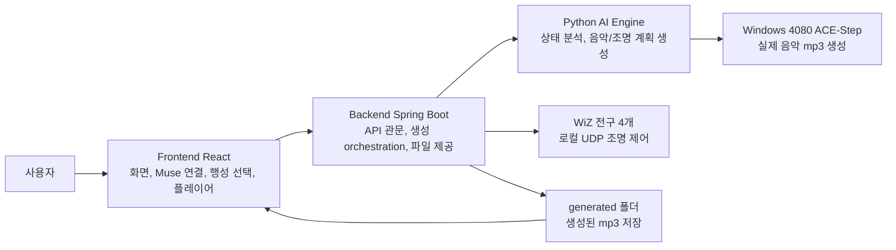
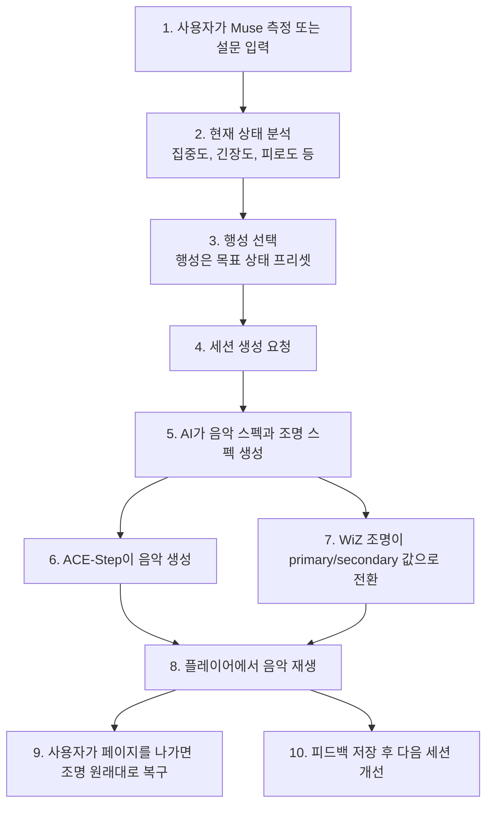
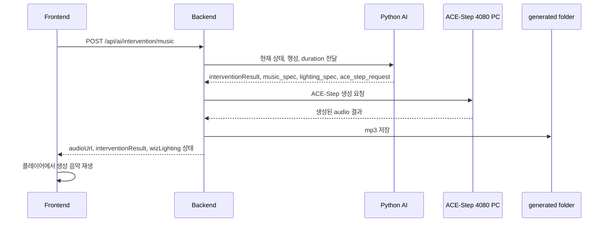
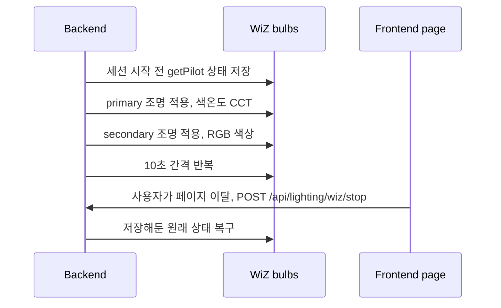
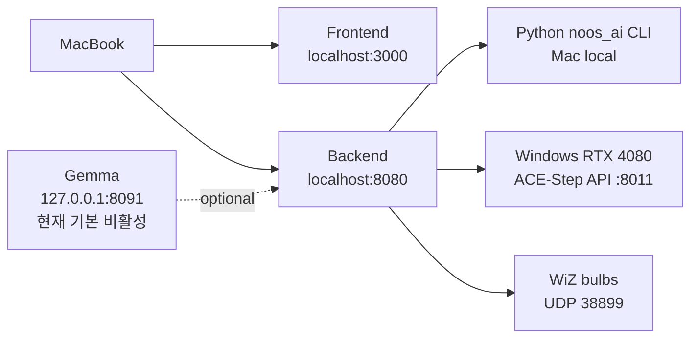
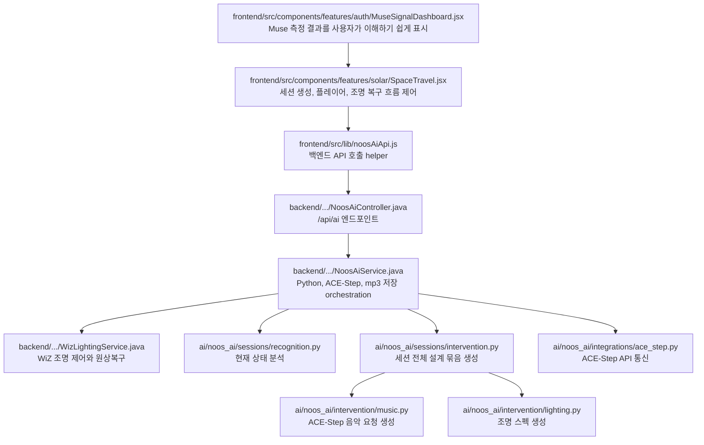

# NOOS System Flow Diagrams

이 폴더는 NOOS 프로젝트의 전체 작동 구조를 처음 보는 사람이 이해할 수 있게 정리한 도식 모음입니다.

## Files

- `01-overall-system.mmd`: 전체 시스템 큰 그림
- `02-user-session-flow.mmd`: 사용자가 세션을 시작해서 종료하기까지의 흐름
- `03-module-responsibilities.mmd`: Frontend, Backend, Python AI, ACE-Step, WiZ의 역할 분리
- `04-music-generation-flow.mmd`: 음악 생성 세부 흐름
- `05-lighting-sync-restore.mmd`: 조명 동기화와 원상복구 흐름
- `06-current-runtime-layout.mmd`: 현재 Mac/Windows/전구 실행 배치
- `07-file-responsibility-map.mmd`: 주요 파일 책임 지도

## 1. Overall System

## 2. User Session Flow

## 3. Module Responsibilities

```mermaid
flowchart TB
  FE["Frontend"] --> FE1["Muse 연결<br/>브라우저 Web Bluetooth"]
  FE --> FE2["상태 화면<br/>사용자가 지금 어떤 상태인지 설명"]
  FE --> FE3["행성 선택과 여행 화면"]
  FE --> FE4["음악 플레이어와 조명 미리보기"]
  FE --> FE5["페이지 이탈 시 조명 복구 요청"]

  BE["Backend"] --> BE1["프론트 요청 접수"]
  BE --> BE2["Python AI CLI 실행"]
  BE --> BE3["ACE-Step 생성 결과 mp3 다운로드"]
  BE --> BE4["생성 mp3를 프론트에 제공"]
  BE --> BE5["WiZ 전구에 UDP 명령 전송"]

  AI["Python AI"] --> AI1["뇌파/설문 상태를 정규화"]
  AI --> AI2["행성 목표 상태와 현재 상태 비교"]
  AI --> AI3["음악 프롬프트와 ACE-Step 요청 생성"]
  AI --> AI4["논문 기반 조명 CCT/RGB 계획 생성"]
```

## 4. Music Generation Flow

## 5. Lighting Sync And Restore

## 6. Current Runtime Layout

## 7. File Responsibility Map

